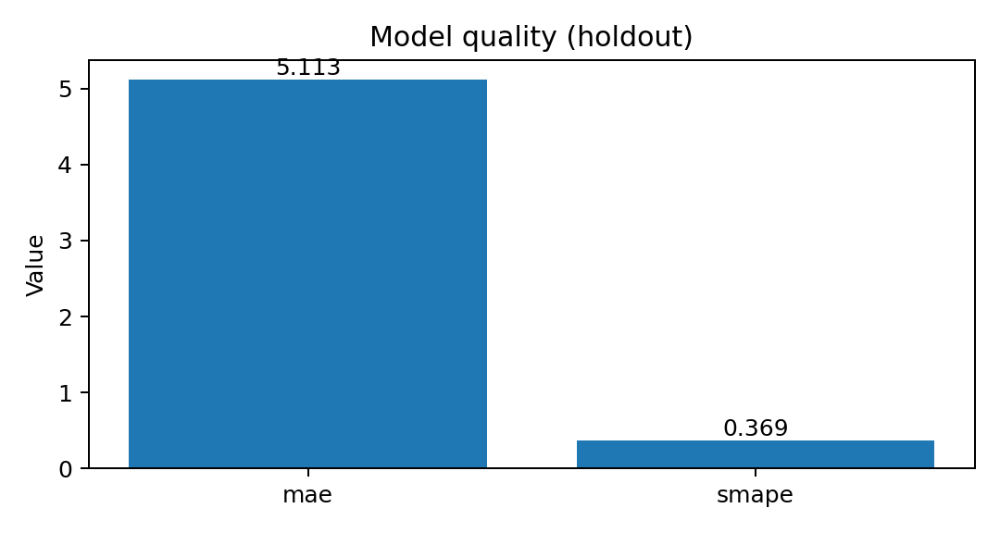
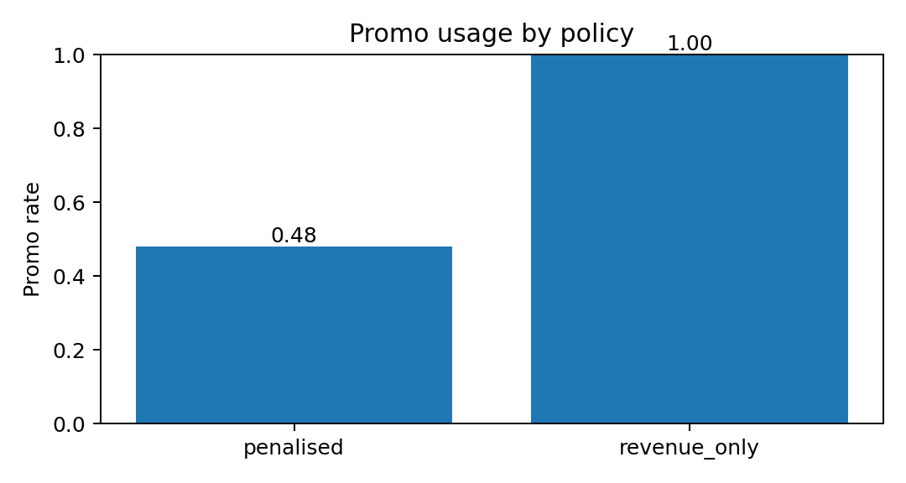
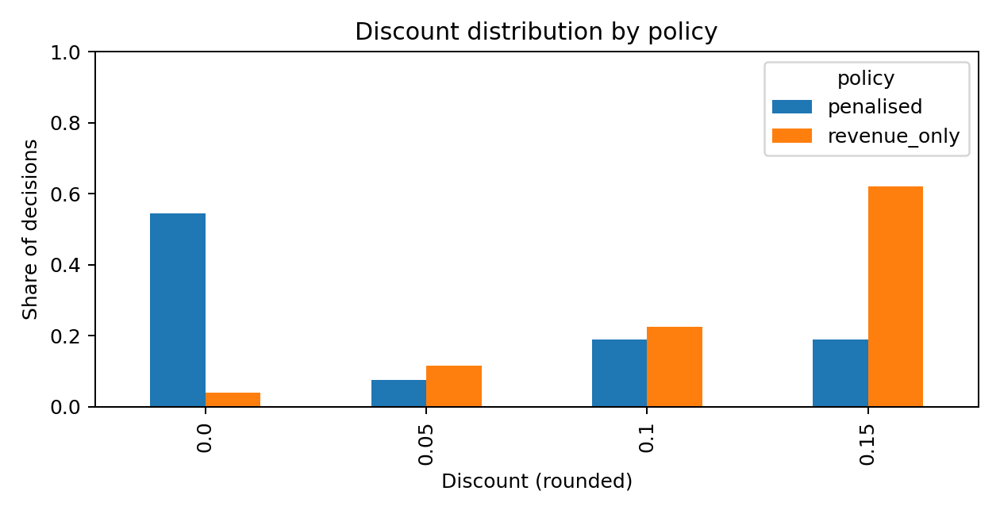

# Retail Decisioning: Demand Modelling + Price/Promo Policy Simulation

A practical retail “decisioning loop” built on dunnhumby *Breakfast at the Frat* data:  
**forecast next-week demand** and **recommend constrained price/promo actions** via predictive simulation.

> This repository is public and **does not include the dataset**. It contains code, configuration, and generated summary artefacts only.

---

## What this project is

Retail teams don’t just want a forecast — they want a decision:
> *Given a store–product context this week, what price and promo action should we take next week, under constraints?*

This repo implements an end-to-end prototype:

1. **Extract** the dunnhumby Excel to parquet
2. **Build features** (lags, rolling means, price/promo signals, seasonality, store & product context)
3. **Train** a demand model (next-week units)
4. **Simulate** candidate actions (price grid × observed promo combinations)
5. **Recommend** actions under two policies:
   - `revenue_only` (naïve baseline)
   - `penalised` (adds penalties to approximate real-world scarcity/cost and margin pressure)

---

## Dashboard





---

## Results

### Demand model (holdout)
- **Test rows:** 103,966 store–product–week observations
- **MAE:** 5.11286 units
- **sMAPE:** 0.368846

### Decisioning behaviour (sample_rows=200)
- **Revenue-only policy**
  - promo rate: **1.00**
  - full-price share (0% discount): **0.04** (8/200)
- **Penalised policy** (λ_discount=75, λ_promo=25)
  - promo rate: **0.48**
  - full-price share (0% discount): **0.545** (109/200)

---

## Data (not included)

Place the Excel workbook here:

```text
data/raw/dunnhumby - Breakfast at the Frat.xlsx


```

---

## Quickstart


---

## Notes

This is **predictive simulation**, not causal uplift modelling. Promotions are observational in the dataset.
